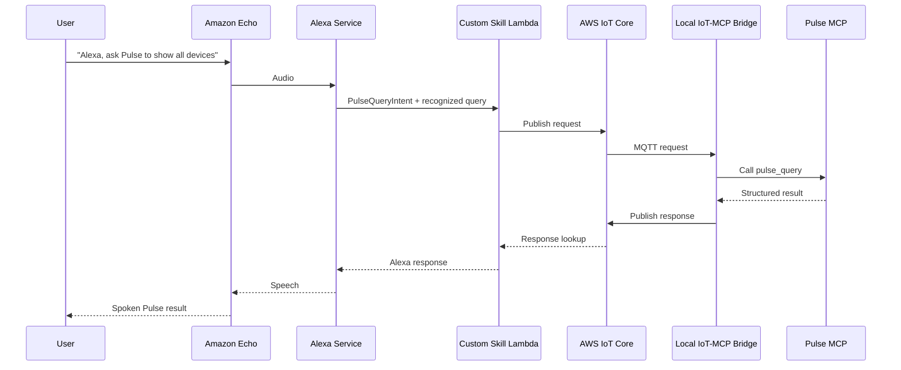

# AWS Integration

## Purpose

This document describes how to use an Amazon Echo for speech recognition and speech output while Pulse remains on the private LAN.

The Echo does not connect directly to the local MCP server. Alexa sends a Custom Skill request to AWS Lambda. Lambda forwards the recognized text through AWS IoT Core to a local bridge, which invokes the Pulse MCP tool and returns a response for Alexa to speak.

No inbound port, public HTTPS server, or tunnel is required on the Pulse network.

## Architecture



## Components

### Alexa Custom Skill

The skill defines a `PulseQueryIntent` with an `AMAZON.SearchQuery` slot. Alexa converts the spoken request to text and includes it in the intent request sent to Lambda.

The existing interaction model is located at:

`virtualMachines/esp32/aggregator/alexa/interaction-model.json`

Example invocation:

> Alexa, ask Pulse to show all devices.

### AWS Lambda

Lambda acts as the Alexa Custom Skill backend. It:

1. Reads the recognized text from the `query` slot.
2. Creates a unique request ID and expiration time.
3. Publishes the request to AWS IoT Core.
4. Waits for the correlated response for a limited time.
5. Returns speech-safe text to Alexa.

Lambda does not call the LAN directly.

### AWS IoT Core

AWS IoT Core carries requests and responses between Lambda and the local bridge. The local bridge initiates the TLS connection, so the LAN does not accept inbound Internet traffic.

Recommended topics:

```text
pulse/{installationId}/requests
pulse/{installationId}/responses
```

The installation ID separates environments and allows topic-scoped security policies.

### Response Store

Lambda cannot reliably depend on a long-lived MQTT subscription. An AWS IoT Rule should copy response messages into DynamoDB, keyed by `requestId`. Lambda polls that record until it receives a result or reaches its response deadline.

DynamoDB records should have a TTL so stale requests are removed automatically.

### Local IoT-MCP Bridge

The bridge runs beside the Pulse MCP server and maintains an outbound MQTT connection to AWS IoT Core. It:

1. Subscribes to the installation request topic.
2. Rejects malformed, expired, or duplicate requests.
3. Calls the local MCP `pulse_query` tool.
4. Converts the result into speech-safe text.
5. Publishes the correlated response.

The existing MCP endpoint defaults to:

```text
http://127.0.0.1:4011/mcp
```

## Message Contracts

### Request

```json
{
  "version": 1,
  "requestId": "4dcf2e9c-82fb-4d27-a92d-444f133f9835",
  "installationId": "home",
  "message": "show all devices",
  "channel": "alexa",
  "createdAt": "2026-08-02T12:00:00.000Z",
  "expiresAt": "2026-08-02T12:00:07.000Z"
}
```

### Successful Response

```json
{
  "version": 1,
  "requestId": "4dcf2e9c-82fb-4d27-a92d-444f133f9835",
  "ok": true,
  "speech": "Three devices are registered. Child one, child two, and child three.",
  "intentId": "all-devices",
  "completedAt": "2026-08-02T12:00:01.400Z"
}
```

### Error Response

```json
{
  "version": 1,
  "requestId": "4dcf2e9c-82fb-4d27-a92d-444f133f9835",
  "ok": false,
  "error": "Pulse MCP did not respond before the request expired",
  "speech": "Pulse could not complete that request. Please try again.",
  "completedAt": "2026-08-02T12:00:07.000Z"
}
```

## AWS Resources

Create these resources in one AWS Region:

1. An Alexa Custom Skill.
2. A Node.js Lambda function for the skill endpoint.
3. An AWS IoT Thing representing the Pulse installation.
4. An AWS IoT device certificate and private key for the local bridge.
5. A topic-restricted AWS IoT policy.
6. A DynamoDB response table keyed by `requestId`.
7. An AWS IoT Rule that writes response messages to DynamoDB.
8. An IAM role allowing Lambda to publish requests and read/delete response records.

## Security

- Store the IoT private key outside the repository.
- Never commit certificates, private keys, AWS access keys, or Alexa credentials.
- Restrict the device policy to the installation's request and response topics.
- Restrict Lambda to the minimum IoT publish and DynamoDB permissions.
- Validate `installationId`, `requestId`, timestamps, payload sizes, and schema versions.
- Reject expired and replayed messages in the local bridge.
- Maintain an allowlist for MCP tools exposed to Alexa.
- Log request IDs and outcomes, but avoid logging secrets or sensitive message contents.
- Keep destructive Pulse operations disabled for voice access unless they require explicit confirmation.

## Timing and Failure Handling

Alexa interactions have a short response window. The complete round trip must therefore be bounded.

Recommended initial budget:

| Stage | Budget |
|---|---:|
| Lambda validation and publish | 500 ms |
| IoT delivery to local bridge | 1,000 ms |
| Pulse MCP execution | 4,000 ms |
| Response delivery and lookup | 1,000 ms |
| Safety margin | 500 ms |

The bridge should return concise status responses for slow operations instead of waiting indefinitely. Lambda must return a friendly failure response when Pulse is offline or the deadline expires.

## Local Configuration

Suggested environment variables for the local bridge:

```dotenv
PULSE_MCP_URL=http://127.0.0.1:4011/mcp
PULSE_AWS_IOT_ENDPOINT=example-ats.iot.us-east-1.amazonaws.com
PULSE_AWS_IOT_CLIENT_ID=pulse-home
PULSE_AWS_IOT_INSTALLATION_ID=home
PULSE_AWS_IOT_CERT_PATH=C:\pulse-secrets\device.pem.crt
PULSE_AWS_IOT_KEY_PATH=C:\pulse-secrets\private.pem.key
PULSE_AWS_IOT_CA_PATH=C:\pulse-secrets\AmazonRootCA1.pem
```

Suggested Lambda environment variables:

```dotenv
PULSE_INSTALLATION_ID=home
PULSE_RESPONSE_TABLE=PulseAlexaResponses
PULSE_RESPONSE_TIMEOUT_MS=6500
```

## Alexa Setup

1. Create a Custom Skill in the Alexa Developer Console.
2. Import the existing `interaction-model.json` file.
3. Build the interaction model.
4. Configure the AWS Lambda ARN as the skill endpoint.
5. Add the Alexa Skills Kit trigger to Lambda.
6. Restrict the trigger to the Alexa Skill ID.
7. Enable testing for the skill.
8. Test with: `Alexa, ask Pulse to show all devices`.

## Implementation Plan

### Phase 1: Local Simulation

- Implement the IoT-MCP bridge behind a transport interface.
- Use an in-memory request/response transport in tests.
- Verify request validation, expiration, deduplication, MCP invocation, and response formatting.

### Phase 2: AWS Infrastructure

- Provision IoT Core, the IoT Thing, certificates, policy, DynamoDB, IoT Rule, Lambda, and IAM permissions.
- Keep infrastructure definitions in source control while excluding generated secrets.

### Phase 3: End-to-End Test

- Start the Pulse backend and local MCP server.
- Start the local IoT-MCP bridge.
- Invoke the Alexa skill through the developer console.
- Confirm the transcript reaches `pulse_query` and Alexa speaks the correlated result.
- Test offline, timeout, duplicate, expired, and unauthorized requests.

## Current Repository Status

The repository already contains:

- A local Streamable HTTP MCP server.
- The `pulse_query` MCP tool.
- A reusable MCP client.
- An Alexa interaction model.
- Speech-safe response formatting and Alexa unit tests.

The AWS Lambda handler, AWS infrastructure, IoT response rule, and local IoT-MCP bridge remain to be implemented.
