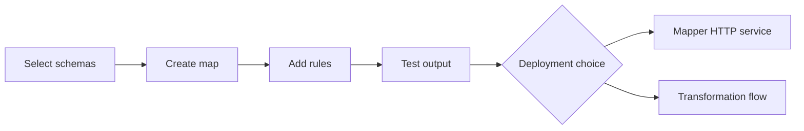
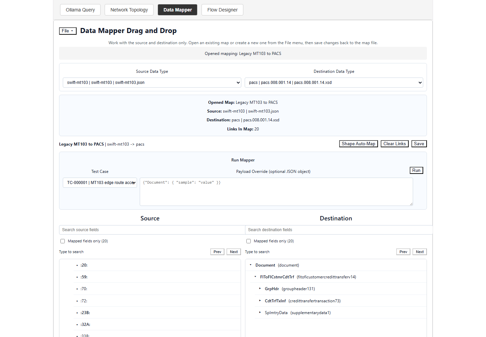
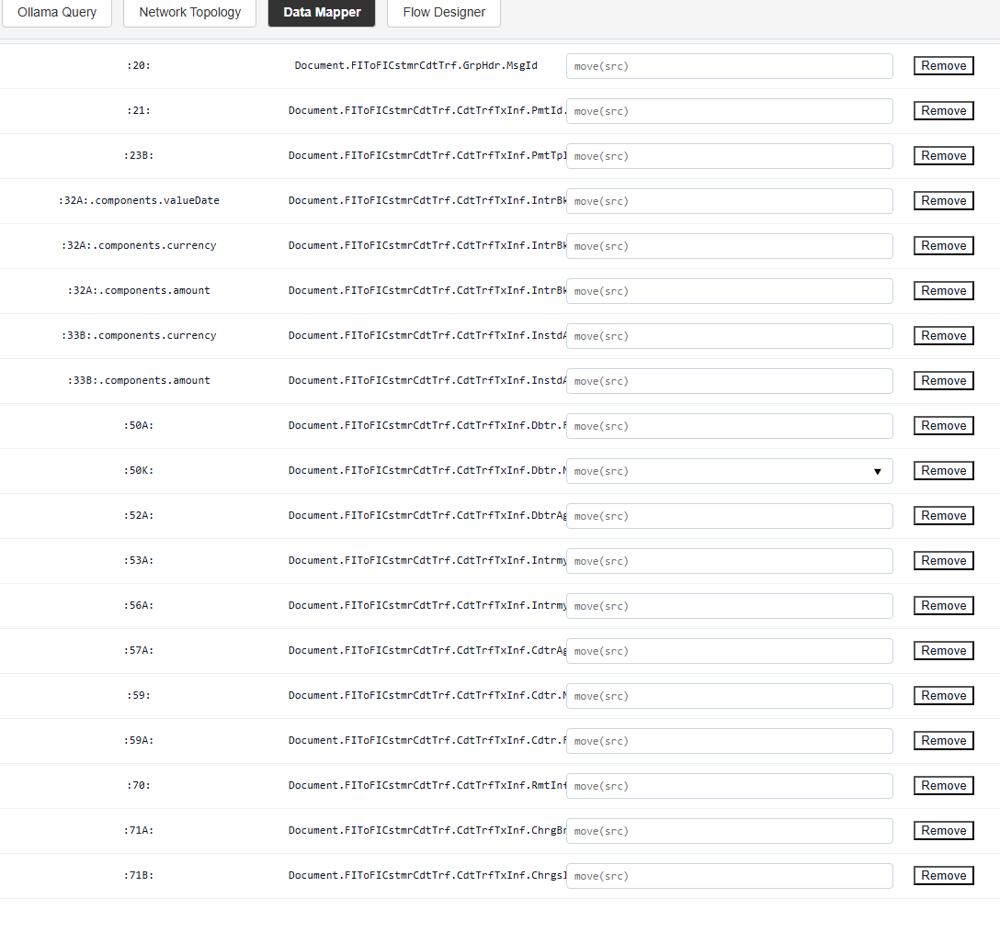
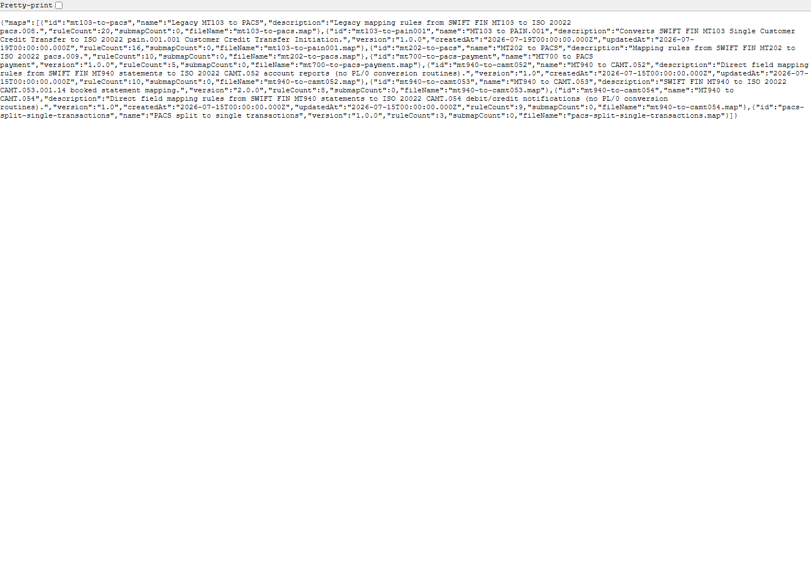
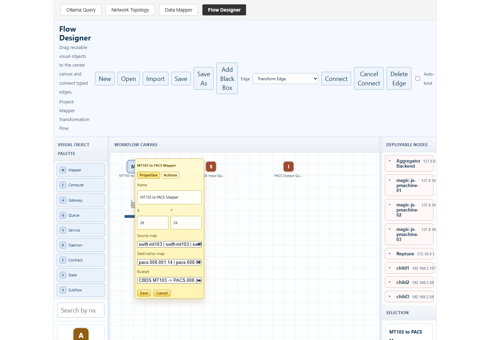

# Creating and Deploying Data Mappers with Pulse

**Draft technical memo**  
**Date:** August 3, 2026  
**Audience:** Solution architects, developers, integration specialists, and technical managers

## Purpose

Pulse can be used to define how one message format becomes another, test that definition with real or sample data, and make the finished mapper available to other parts of a system. A mapper can be offered through a focused HTTP service, or it can be included as a step inside a larger transformation flow.

This memo explains both approaches. It uses a common payment example: converting a SWIFT MT103 message into a PACS message. The same method can be applied to other business documents, device messages, or internal data structures.

> **Reading note:** In Pulse, a *map* is the saved transformation definition. A *mapper* is the software that applies that definition to a message.

## 1. The Mapper Lifecycle

A mapper moves through five practical stages:

1. Discover the source and target schemas.
2. Create field-to-field rules.
3. Add conversion logic where a direct move is not enough.
4. Run the map against a test message.
5. Publish or bind the map for runtime use.



Pulse separates the map from its runtime placement. This is useful because the same map can be tested centrally, called through an API, or attached to a distributed flow without rewriting its business rules.

## 2. Select the Source and Target Schemas

The Data Librarian provides the contracts used by the mapper. A contract describes the structure of a message, including its fields, nested groups, data types, and lifecycle status.

In the mapper screen, the author selects a source schema and a destination schema. For the example in this memo, the source is a SWIFT MT103 structure and the destination is a PACS structure.


**Figure 1. Selecting the source and destination schemas in the Data Mapper.** The source tree appears on the left and the destination tree appears on the right. The selected schemas become part of the saved map.

The schema choice is more than a label. Pulse stores schema paths and shape information with the map. Before a saved map runs, the runtime can detect whether a source or target schema has changed since the map was saved. This helps prevent an older map from silently processing a newer message structure.

## 3. Build the Mapping Rules

The Data Mapper presents the source and destination structures side by side. An author can drag a source field to a compatible destination field. Each link becomes a mapping rule.

A rule records at least:

- the source field path;
- the destination field path;
- whether the rule maps a leaf or a branch;
- the source and destination value types; and
- an optional conversion routine.


**Figure 2. Building field rules in the mapper.** The centre area shows the links already created. Search and mapped-only controls help when schemas contain many fields.

For branches with the same shape, Pulse can generate a group of leaf-to-leaf rules through shape-aware mapping. The system first checks that the selected branches are structurally equivalent. It then adds rules that do not already exist.

Direct moves do not require code when the source and destination types are compatible. A direct move is appropriate for values such as an identifier copied from one text field to another text field.

## 4. Add Conversion Logic

Some fields need more than a direct copy. A source value may need trimming, case conversion, formatting, calculation, or another controlled operation. Pulse allows a rule to include a small Pascalish/PL0 conversion routine.

For example:

```text
output := trim(src);
```

The runtime passes the source value in `src`. The routine places the final value in `output`. This convention keeps each rule focused and makes the transformation easier to inspect.


**Figure 3. Adding a conversion routine to a field rule.** Pulse validates the routine before the map is saved or run.

If a source and destination field have different known types, Pulse requires a conversion routine instead of guessing. This is a useful control: an author must make the intended conversion explicit.

## 5. Save and Test the Map

Pulse saves the mapper definition as a `.map` artifact. The artifact contains its identity, schema references, shape signatures, rules, timestamps, and optional submaps.

The mapper can be run with a JSON payload or a stored test case. During a test, Pulse:

1. reads the selected map;
2. checks the saved schema timestamps;
3. reads each source value;
4. runs any conversion routine;
5. writes the value to the destination path; and
6. returns the output with diagnostics.


**Figure 4. Running a saved map and reviewing the transformed output.** Diagnostics identify missing source fields and confirm when a conversion routine was applied.

A successful test should confirm more than an HTTP status. The author should compare the output structure with the destination contract and check required business values, field formats, and any warnings.

## 6. Deployment Option A: Mapper as a Service

The first deployment option is to expose mapping through the dedicated Data Mapper service. By default, this service listens on port `4200`. Applications can also reach it through the main Pulse backend proxy, which keeps callers on the common secure application address.

A client runs a saved map with:

```http
POST /api/mapper/maps/{mapId}/run
Content-Type: application/json

{
  "payload": {
    "sourceField": "source value"
  }
}
```

The response contains the original input, transformed output, and diagnostics.

```json
{
  "mapId": "mt103_to_pacs",
  "input": {},
  "output": {},
  "diagnostics": []
}
```


**Figure 5. Calling the mapper through the secure Pulse API.** The service model is useful when another application needs a clear request-and-response contract.

This option works well when:

- several applications need the same mapper;
- clients already use HTTP APIs;
- the mapper should be managed and scaled separately; or
- a team wants a simple integration boundary.

The service should be monitored like any other production API. Health checks, map version control, request limits, authentication, logging, and rollback procedures remain important.

## 7. Deployment Option B: Mapper in a Transformation Engine

The second option is to place the mapper inside a larger Pulse flow. In the Flow Designer, a Mapper node identifies an input schema, an output schema, and a ruleset. A transform edge passes the mapped result to the next node.

A typical payment flow may look like this:



**Figure 6. A Mapper node inside a larger transformation flow.** The node refers to mapping logic while the surrounding flow controls queues, services, decisions, and completion paths.

Pulse can publish a deployment package containing several related artifacts:

- an intent document describing the requested mapper;
- a manifest with identity and integrity information;
- MAPL mapping source;
- Pascalish routing or service source; and
- WFL deployment and queue bindings.

A WFL artifact can describe a service, its input and output queues, a target cluster, and queue binding modes. The deployment planner then binds a Mapper node to a target that provides the `mapper-engine` capability.

This option works well when:

- mapping is one stage in a longer message flow;
- queues provide buffering, retry, or parallel processing;
- placement near the data source is valuable;
- the flow includes validation, routing, gateways, or state recording; or
- the workload should run across compatible JavaScript or edge pmachine nodes.

### Current Deployment Boundary

Pulse records published mapper deployments and can mark mapper inventory entries as deployed. The current deployment records use the mode `artifact-publish-only`. This means that the required artifacts have been generated and registered. It should not be read as proof that every target runtime has already loaded and started the mapper.

Runtime readiness should be confirmed separately by checking target bindings, service or worker health, queue status, and a test message sent through the deployed path.

## 8. Choosing a Deployment Model

| Question | Mapper service | Transformation engine |
|---|---|---|
| How is it called? | HTTP request | Flow, queue, or service step |
| Best fit | Direct application integration | Multi-stage processing |
| Scaling unit | Mapper service process | Bound workers or runtime nodes |
| Flow controls | Managed by the caller | Queues, retries, routes, and state |
| Placement | Central service host | Compatible flow targets |
| Validation | API result and diagnostics | End-to-end flow and queue evidence |

The two approaches are not mutually exclusive. A team may first publish a stable map through the service API, then reuse the same business mapping in a flow that adds routing, workload distribution, and operational controls.

## 9. Recommended Delivery Process

For a production mapper, use a controlled promotion path:

1. Confirm the active source and destination schemas.
2. Create and review mapping rules.
3. Add explicit conversion routines for type changes.
4. Test normal, missing-field, and invalid-value cases.
5. Save and version the map artifact.
6. Choose the service or transformation-flow model.
7. Publish the deployment artifacts.
8. Confirm the target is bound and healthy.
9. Send a known test message through the deployed path.
10. Record output, diagnostics, and rollback information.

This process keeps authoring, deployment, and runtime evidence separate. That separation makes approvals clearer and reduces the chance of treating a generated artifact as a running production service.

## 10. Conclusion

Pulse provides a practical path from schema discovery to a tested mapper. The Data Librarian supplies the contracts, the Data Mapper captures and tests the rules, and the runtime layer offers two ways to use the result.

A standalone mapper service gives applications a direct API. A mapper inside a transformation engine becomes part of a broader flow with queues, routing, services, and distributed runtime placement. Both models use the same central idea: transformation rules should be visible, testable, versioned, and deployed with evidence.

---

## Appendix A: Main Runtime Interfaces

| Purpose | Interface |
|---|---|
| List Librarian schemas | `GET /api/librarian/schemas` |
| List maps | `GET /api/mapper/maps` |
| Read one map | `GET /api/mapper/maps/{id}` |
| Create a map | `POST /api/mapper/maps` |
| Update a map | `PUT /api/mapper/maps/{id}` |
| Generate compatible branch rules | `POST /api/mapper/maps/{id}/auto-shape-map` |
| Run and validate a map | `POST /api/mapper/maps/{id}/run` |
| Secure application entry point | `https://neptune/` |

## Appendix B: Screenshot Production Notes

Screenshots were captured from the live secure application at `https://neptune/` with a 1440 by 1000 pixel browser viewport. Each image shows the control or result discussed in the nearby text. Sensitive values and unrelated browser controls were excluded. The PDF layout keeps captions with their images where page space permits.
