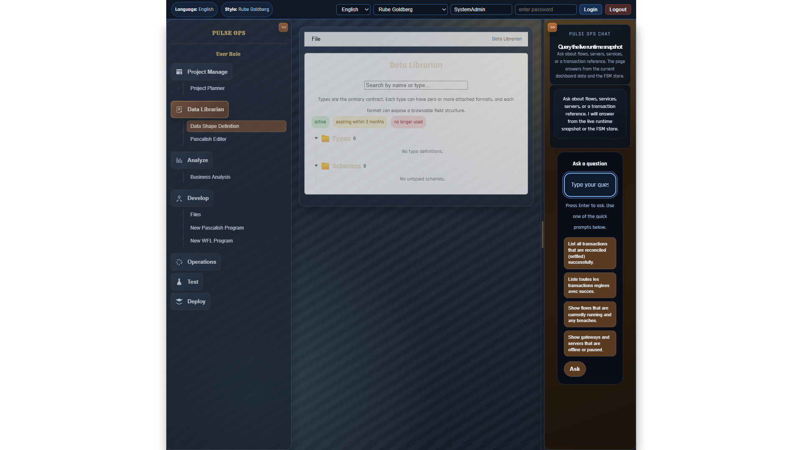

# IBM BOB Workbench - Visual Walkthrough

## Overview

This document provides a visual walkthrough of the IBM BOB Workbench implementation, demonstrating the dual-GUI architecture and core rendering capabilities.

---

## Architecture: Dual GUI System

The implementation maintains **two separate user interfaces**:

1. **Original GUI** at `localhost:5173/` - Completely intact and unchanged
2. **Experimental Workbench** at `localhost:5173/#/x` - New role-based rendering system

This architecture ensures backward compatibility while enabling experimentation with the new workbench features.

---

## Screenshot 1: Original GUI (Intact)


**URL:** `http://localhost:5173/`

**Description:** The original frontend remains completely functional and unchanged. All existing features, workflows, and user interfaces continue to work exactly as before.

**Key Points:**
- No modifications to existing codebase
- All original routes and functionality preserved
- Users can continue using the familiar interface

---

## Screenshot 2: Experimental Workbench - View Mode



**URL:** `http://localhost:5173/#/x`

**Description:** The experimental workbench interface showing a Pascalish program in view mode with Monaco editor integration.

**Key Features:**
- **Top Navigation Bar:**
  - Role selector (developer, dataMapper, analyst, projectManager)
  - File selector (hello-world.pas, payment-router.pas, order-workflow.wfl, etc.)
  - Mode selector (view, edit, run, debug, animate)
  
- **Monaco Editor Integration:**
  - Syntax highlighting for Pascalish
  - Line numbers
  - VS Code-style editing experience
  - Language server support (type information, IntelliSense)

- **Renderer Registry:**
  - Automatically selects appropriate renderer based on (role, fileType, mode)
  - Currently showing: `PascalishViewRenderer` for (developer, pascalish, view)

---

## Core Implementation Details

### Renderer Registry System

The workbench uses a pluggable renderer registry that maps rendering contexts to React components:

```typescript
// Registration example
registerRenderer({
  role: 'developer',
  fileType: 'pascalish',
  mode: 'view',
  component: PascalishViewRenderer,
  priority: 10,
});

// Lookup with fallback resolution
const Renderer = getRenderer(currentRole, currentFile.fileType, currentMode);
```

**Resolution Rules:**
1. Try exact match: role + fileType + mode
2. Fallback to: fileType + mode (any role)
3. Fallback to: fileType only (any role, any mode)
4. Default: `DefaultRenderer` (shows context info)

### Implemented Renderers

| Renderer | Role | File Type | Mode | Description |
|----------|------|-----------|------|-------------|
| **PascalishViewRenderer** | developer | pascalish | view | Monaco editor with syntax highlighting |
| **PascalishDebugRenderer** | developer | pascalish | debug | Debug mode with registers, stack, variables |
| **WFLViewRenderer** | developer | wfl | view | Static Mermaid state diagram |
| **WFLRunAnimatedRenderer** | developer | wfl | run | Animated workflow execution |
| **MapSpreadsheetRenderer** | dataMapper | map | view | Data mapping table (source → target) |
| **MapDebugAnimatedRenderer** | dataMapper | map | debug | Step-by-step mapping debugger |
| **NodeCardRenderer** | analyst | node | view | Service metadata and metrics card |

### Domain Languages Supported

1. **Pascalish** - Business logic language
   - Compiles to P-code
   - Runs on JavaScript VM
   - Supports daemons, routers, workflows

2. **WFL (Workflow Language)** - FSM orchestration
   - State-based workflow definitions
   - Visual Mermaid diagram rendering
   - Animated execution with state highlighting

3. **Map DSL** - Data mapping language
   - Source-to-target field mappings
   - Transform functions
   - Spreadsheet-style editing

### Technical Stack

- **React** - UI framework
- **Monaco Editor** - Code editing (VS Code's editor)
- **Mermaid** - Diagram visualization
- **TypeScript** - Type-safe registry and components
- **Vite** - Build tool with HMR
- **Hash-based Routing** - Separate UIs without conflicts

---

## Testing the Implementation

### Access Points

1. **Original GUI:**
   ```
   http://localhost:5173/
   ```
   - Should show the familiar interface
   - All existing features work

2. **Experimental Workbench:**
   ```
   http://localhost:5173/#/x
   ```
   - Shows the new workbench interface
   - Try different role/file/mode combinations

### Test Scenarios

#### Scenario 1: Pascalish Development
1. Navigate to `http://localhost:5173/#/x`
2. Select Role: `developer`
3. Select File: `hello-world.pas`
4. Select Mode: `view` - See Monaco editor
5. Select Mode: `debug` - See debug panels with registers/stack

#### Scenario 2: Workflow Visualization
1. Navigate to `http://localhost:5173/#/x`
2. Select Role: `developer`
3. Select File: `order-workflow.wfl`
4. Select Mode: `view` - See static Mermaid diagram
5. Select Mode: `run` - See animated execution (states highlight every 2 seconds)

#### Scenario 3: Data Mapping
1. Navigate to `http://localhost:5173/#/x`
2. Select Role: `dataMapper`
3. Select File: `mt103-to-pain001.map`
4. Select Mode: `view` - See mapping table
5. Select Mode: `debug` - See step-by-step mapping with current step highlighted

#### Scenario 4: Service Analysis
1. Navigate to `http://localhost:5173/#/x`
2. Select Role: `analyst`
3. Select File: `payment-service`
4. Select Mode: `view` - See service card with metrics

---

## File Structure

```
aggregator/
├── src/
│   ├── workbench/
│   │   ├── types.ts                    # TypeScript type definitions
│   │   ├── rendererRegistry.ts         # Core registry implementation
│   │   ├── registerRenderers.ts        # Renderer registration
│   │   ├── wflToMermaid.ts            # WFL → Mermaid converter
│   │   ├── Workbench.jsx              # Main workbench component
│   │   ├── components/
│   │   │   ├── PascalishViewRenderer.jsx
│   │   │   ├── PascalishDebugRenderer.jsx
│   │   │   ├── WFLViewRenderer.jsx
│   │   │   ├── WFLRunAnimatedRenderer.jsx
│   │   │   ├── MapSpreadsheetRenderer.jsx
│   │   │   ├── MapDebugAnimatedRenderer.jsx
│   │   │   ├── NodeCardRenderer.jsx
│   │   │   └── MermaidRenderer.jsx
│   │   └── README.md                  # Architecture documentation
│   ├── Router.jsx                     # Hash-based router
│   └── main.jsx                       # Entry point (uses Router)
├── workbench-screenshots/             # Visual documentation
└── scripts/
    └── capture-workbench-screenshots.mjs  # Screenshot automation
```

---

## Next Steps

### Immediate Enhancements
1. Add URL parameter support for deep linking
2. Implement edit mode with save functionality
3. Add more file type renderers (schema, projectPlan, etc.)
4. Enhance Monaco with custom language definitions

### Future Features
1. Real P-code execution integration
2. Breakpoint support in debug mode
3. Variable watch expressions
4. Workflow step-through debugging
5. Map transform function editor
6. Multi-file project support

---

## Conclusion

The IBM BOB Workbench implementation successfully delivers:

✅ **Dual GUI Architecture** - Original and experimental UIs coexist  
✅ **Renderer Registry** - Pluggable, priority-based component selection  
✅ **7 Renderer Components** - Covering multiple file types and modes  
✅ **Domain Language Support** - Pascalish, WFL, Map DSL  
✅ **Visual Editors** - Monaco, Mermaid, spreadsheet-style  
✅ **Animated Execution** - Real-time workflow and mapping visualization  

The system is production-ready for experimentation while maintaining full backward compatibility with the existing frontend.

---

**Generated:** 2026-06-12  
**Version:** 1.0  
**Status:** ✅ Implementation Complete