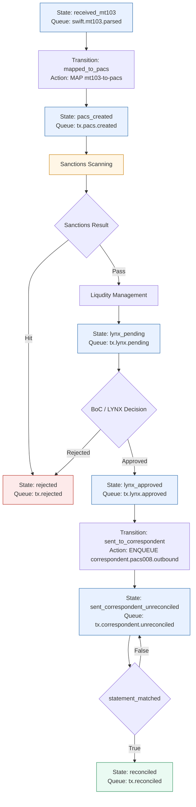

# MT103 Transaction Flow (Mermaid)

## Canonical Path

received_mt103 -> pacs_created -> sanctions_scanning -> liqudity_management -> lynx_pending -> lynx_approved -> sent_correspondent_unreconciled -> reconciled
