# Onboarding Story: Build MT103 and MT202 Flows to PACS as a Developer or Business Analyst

## Why this guide exists
You are joining the project and your first deliverable is practical:
1. Model the inbound message families MT103, MT202, and MT202COV.
2. Map them to PACS008 and PACS009.
3. Connect maps to routing and lifecycle behavior.
4. Validate with runtime evidence and governance controls.

This document is written as a narrated walkthrough, from first login to first successful end to end flow.

## Chapter 1: First look at the platform
When you first land in the workspace, start by understanding what is alive right now: flows, services, servers, and tasks.

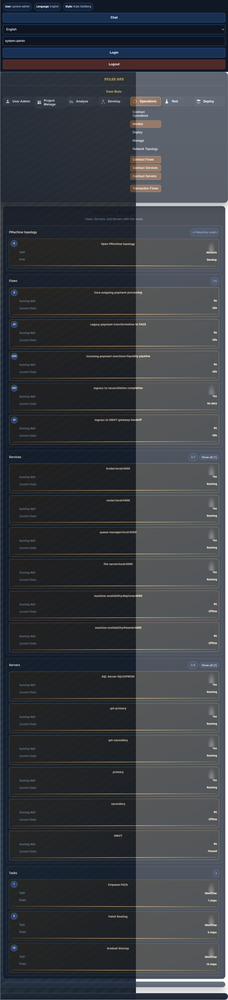

### What to notice
1. Flow cards show whether throughput is healthy.
2. Service and server cards show runtime status.
3. Task cards expose authored workflow assets you will edit next.

## Chapter 2: Understand runtime topology before changing logic
As a developer or BA, you need to know where your flow executes. Open Develop and inspect node topology.

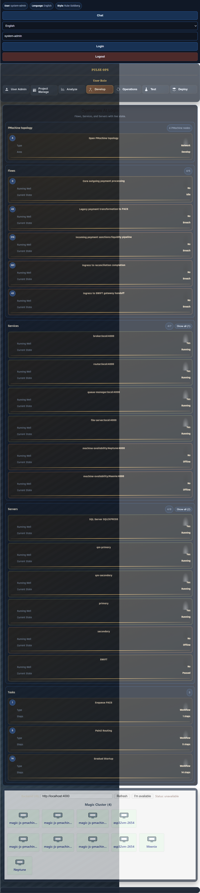

### Why this matters
1. You can quickly tell whether your environment is single node or distributed.
2. This helps explain queue timing and failover behavior during testing.

## Chapter 3: Learn where your design actions live
Open Operations and expand the task menu. This is your navigation spine for monitoring, deploy, and flow centric views.

### How to use this menu
1. Use Monitor when validating message progression.
2. Use Manage when checking flow targets and queue manager behavior.
3. Use Deploy when validating gateway level execution.

## Chapter 4: Project planning context for implementation work
Open Project Manage. In onboarding week, this is where BA and dev scope alignment usually starts.

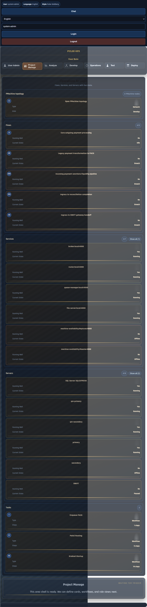

### What to do here
1. Track the story you are implementing.
2. Tie your mapping and flow artifacts to project milestones and deliverables.

## Chapter 5: Confirm identity and role context first
Before authoring or changing any flow logic, confirm your user profile and project role alignment.

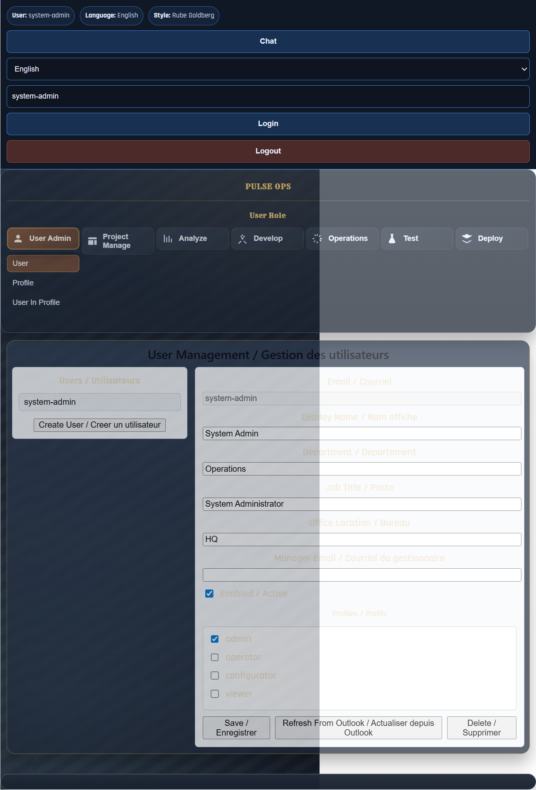

### Onboarding rule
1. Do not create and authorize the same business action with a toxic role combination.
2. Keep creator and authorizer duties separated.

## Chapter 6: Start in Data Librarian and establish the contracts
Open Analyze and begin in Data Librarian. This is where message contracts become explicit and reusable.

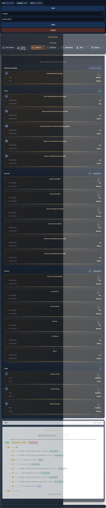

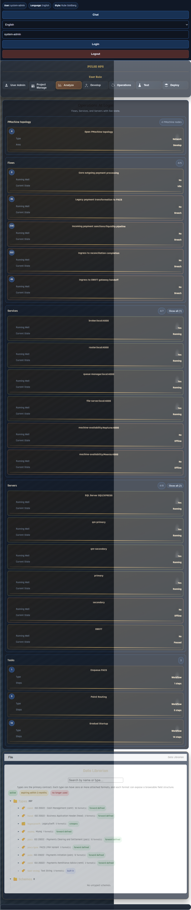

### Your first contract checklist
1. Confirm these input families exist:
   - swift-mt103
   - swift-mt202
   - swift-mt202cov
2. Confirm these target families exist:
   - pacs008
   - pacs009
3. If missing, add type metadata and schema references first, then continue.

## Chapter 7: Build the conversion story from legacy to ISO
Focus the catalog first on LegacySwift, then on PACS. This makes source and target contexts explicit while you map fields.

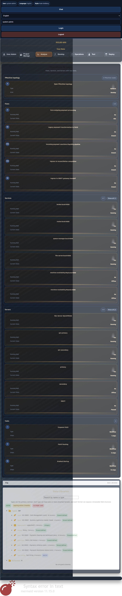

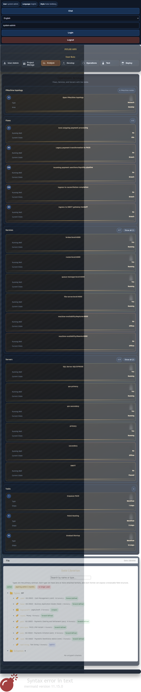

### Mapping model you should produce
1. MT103 to PACS008.
2. MT202 to PACS009.
3. MT202COV to PACS009 with COV specific handling.

### Minimum fields for each map
1. Sender BIC and receiver BIC.
2. Amount and currency.
3. Value date.
4. Reference and remittance content.
5. Guard expressions for mandatory field validation.

## Chapter 8: Wire maps to routing behavior
Open the routing workflow view and confirm that each inbound message type lands on the correct output contract and downstream queue.

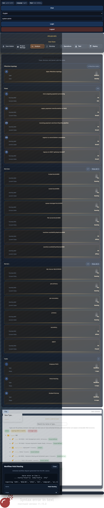

### Routing outcomes to confirm
1. MT103 path emits PACS008.
2. MT202 path emits PACS009.
3. MT202COV path emits PACS009.
4. Rejection and fallback conditions are explicit.

## Chapter 9: Tie business events to lifecycle states
Move to the transaction lifecycle view and verify that your flow has a complete state journey.

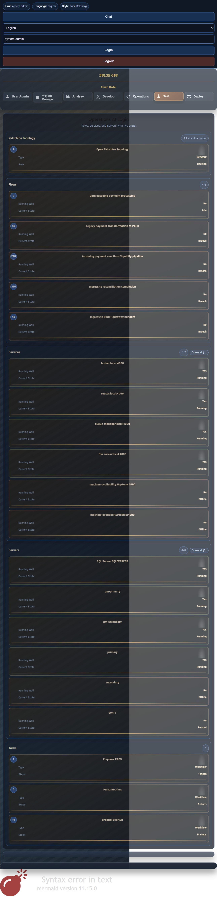

### Lifecycle states expected in onboarding scenarios
1. Received.
2. Mapped.
3. Routed.
4. Pending authorization.
5. Authorized.
6. Submitted.
7. Settled or rejected.

## Chapter 10: Validate deployment path and runtime workers
Open Deploy and verify gateway worker behavior while your test messages run.

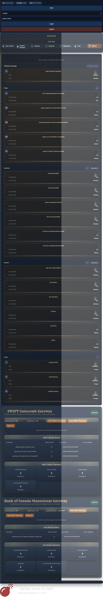

### Runtime validation checklist
1. Workers are running and timestamps are fresh.
2. Queue telemetry changes during test execution.
3. No persistent error row in worker status tables.

## Chapter 11: First end to end onboarding test
Now run three samples and narrate results to your project lead as a story:
1. I submitted MT103 and observed PACS008 output.
2. I submitted MT202 and observed PACS009 output.
3. I submitted MT202COV and observed PACS009 output.

For each run, capture:
1. Input payload id.
2. Output payload id.
3. Lifecycle state progression.
4. Queue and worker evidence.

## Chapter 12: Governance and audit in day 1 language
As a developer or BA, governance is not a separate audit phase. It is part of done criteria for every flow change.

### Done criteria for a new flow or map change
1. Contract is defined in Data Librarian.
2. Mapping is valid for source and target schemas.
3. Routing points to correct output and queue path.
4. Lifecycle covers happy and error paths.
5. Toxic role combinations are blocked for controlled actions.
6. Audit trail entries can be retrieved for approve and deny decisions.

## Quick reference for new team members
1. Start with contracts, not code.
2. Keep map logic reusable and isolate exceptions in adapters.
3. Verify runtime evidence while building, not at the end.
4. Treat governance checks as a design requirement.
